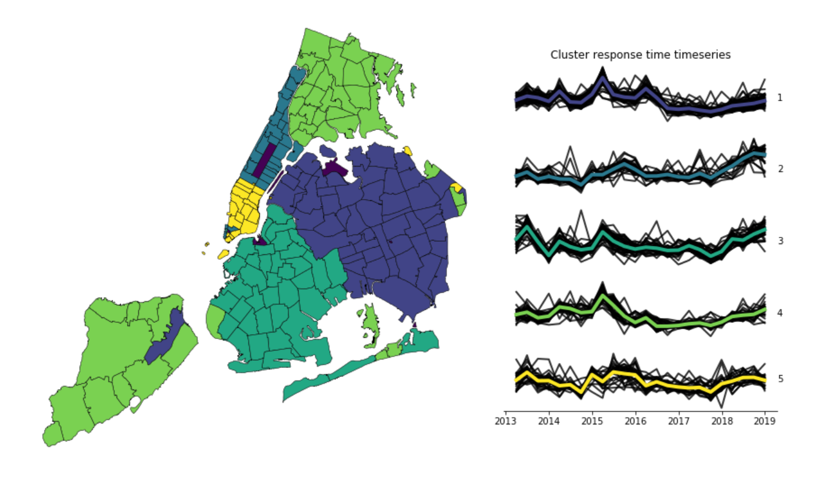

# Exploratory data analysis of FDNY EMS response times

Work done as preliminary analysis for the [Urban Intelligence Lab](http://www.urbanintelligencelab.org/) project with FDNY.

[This notebook](https://github.com/pmandiola/fdny-ems-data-exploration/blob/master/descriptive-analysis.ipynb) contains the analysis, including:

* K-Means clustering of timeseries data by zipcode.
* Response time and # of incidents by time of day
* Initial vs actual severity level of the EMS call
* Response time vs # of incidents by Borough

## Data Sources

NYC Open Data:
* [EMS Incident Data](https://data.cityofnewyork.us/Public-Safety/EMS-Incident-Dispatch-Data/76xm-jjuj)
* [Zip Code Boundaries](https://data.cityofnewyork.us/Business/Zip-Code-Boundaries/i8iw-xf4u)
